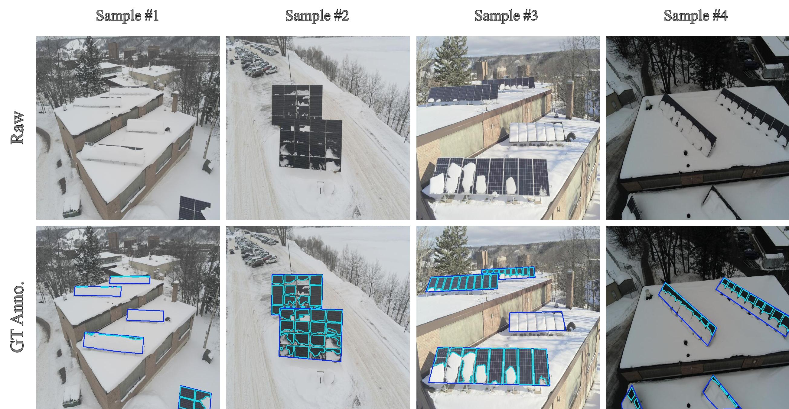
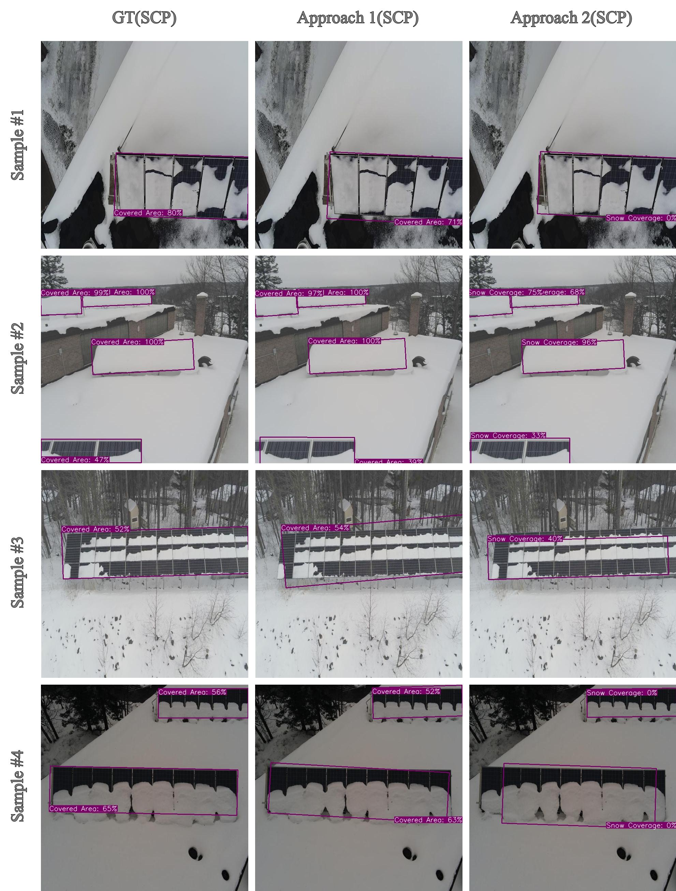

# Estimating Snow Coverage Percentage on Solar Panels Using Drone Imagery and Machine Learning for Enhanced Energy Efficiency

**Abstract:** Snow accumulation on solar panels presents a significant challenge to energy generation in snowy regions, reducing the efficiency of solar photovoltaic (PV) systems and impacting economic viability. While prior studies have explored snow detection using fixed-camera setups, these methods suffer from scalability limitations, stationary viewpoints, and the need for reference images. This study introduces an automated deep-learning framework that leverages drone-captured imagery to detect and quantify snow coverage on solar panels, aiming to enhance power forecasting and optimize snow removal strategies in winter conditions. We developed and evaluated two approaches using YOLO-based models: Approach 1, a high-precision method utilizing a two-class detection model, and Approach 2, a real-time single-class detection model optimized for fast inference. While Approach 1 demonstrated superior accuracy, achieving an overall precision of 89% and recall of 82%, it is computationally expensive, making it more suitable for strategic decision-making. Approach 2, with a precision of 93% and a recall of 75%, provides a lightweight and efficient alternative for real-time monitoring but is sensitive to lighting variations. The proposed framework calculates snow coverage percentages (SCP) to support snow removal planning, minimize downtime, and optimize power generation. Compared to fixed-camera-based snow detection models, our approach leverages drone imagery to improve detection precision while offering greater scalability to be adopted for large solar farms. Qualitative and quantitative analysis of both approaches is presented in this paper, highlighting their strengths and weaknesses in different environmental conditions.

 Fig.1 Sample images from the collected dataset and their corresponding visualized ground truth annotations.

 Fig.1 Visualized sample images for detection, segmentation, and ground truth annotations.

All models' checkpoints can be found in the link below:
https://drive.google.com/drive/folders/1PbRlxzXpyjRXGPyuF_e6yhEZ73NULmgT?usp=sharing

***
## New Demos from our updated models
Here, you can find several demos of real-time snow coverage percentage detection using the Otsu thresholding method. The models showcased have been trained on our newly augmented dataset available in this repo.

https://github.com/user-attachments/assets/ca8f2344-1672-4dd9-813d-9a8f77060ae8

https://github.com/user-attachments/assets/0a2075fc-fac8-411e-ac6f-8bec2928a26b

